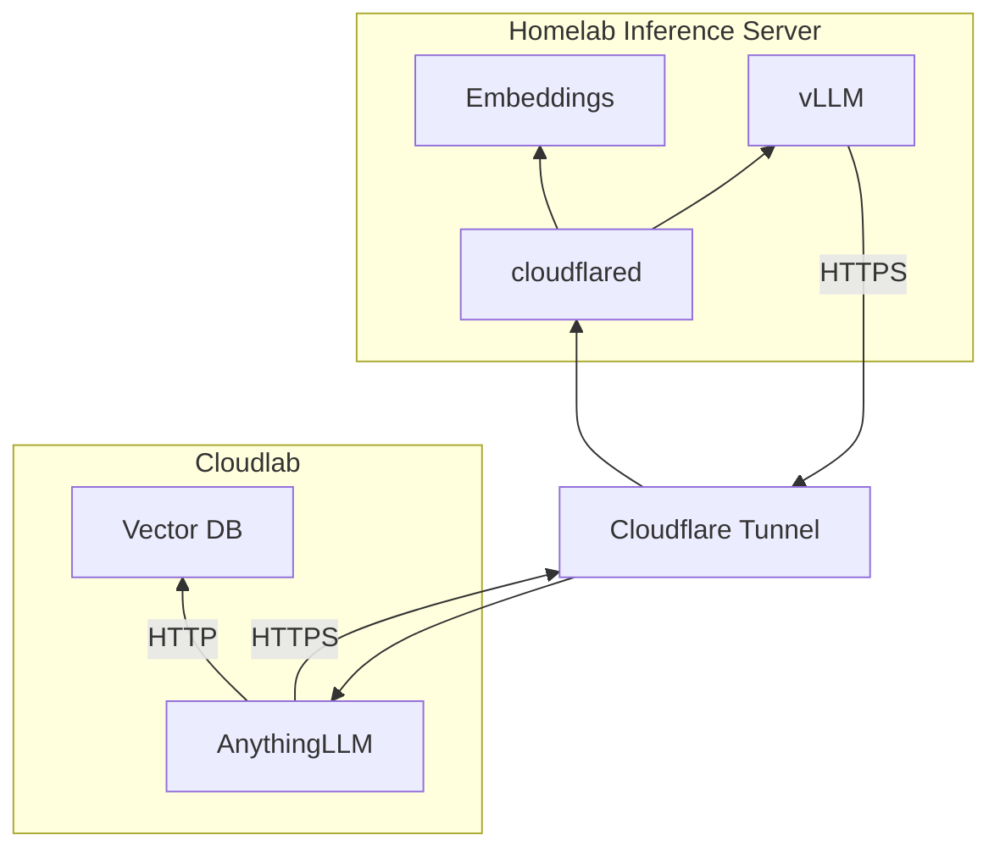

Daniel Adan Soto

# Distributed Self-Hosted LLM Platform

RAG-enabled, multi-host LLM deployment using AnythingLLM, vLLM, and Cloudflare Tunnel.

## Architecture

## Base Images 

**Cloudlab Host**
- mintplexlabs/anythingllm
- qdrant/qdrant

**Homelab Host**
- vllm/vllm-openai
- vllm/vllm-openai
- cloudflare/cloudflared
