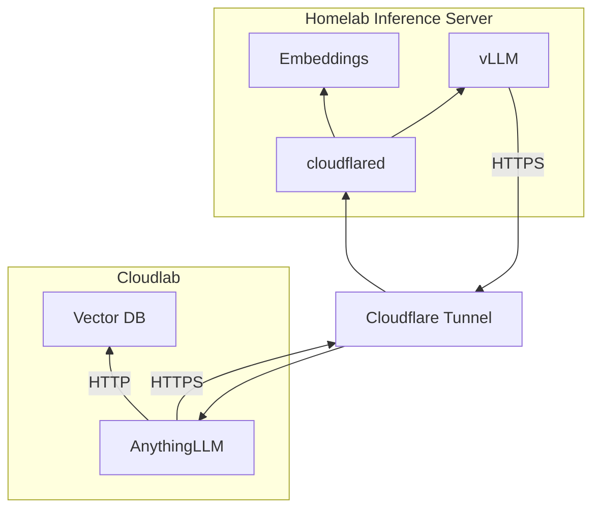

Daniel Adan Soto

# Distributed Self-Hosted LLM Platform

RAG-enabled, multi-host LLM deployment using AnythingLLM, vLLM, and Cloudflare Tunnel.

---
# Chapter 1: Project Overview

### 1.1 Project Goal

The goal of this project is to design and deploy a **distributed, self-hosted Large Language Model (LLM) platform** that supports **retrieval-augmented generation (RAG)** while maintaining full control over data, inference, and infrastructure.

Rather than relying on a monolithic or third-party hosted LLM service, the system separates responsibilities across multiple hosts to improve **security, scalability, and operational flexibility**. The platform is intended to support knowledge-grounded question answering over private document collections while minimizing external exposure and avoiding vendor lock-in.

The system is guided by the following design principles:

- **Separation of Concerns**  
  User interaction, knowledge storage, and model inference are deployed as independent services.

- **Private Connectivity**  
  Communication between hosts occurs exclusively through a secure tunnel without exposing inference services directly to the public internet.

- **Extensibility**  
  Models, embedding services, and vector databases can be replaced or upgraded without redesigning the overall system.

At completion of the project the existing templates and files can be modified to maintain a fully local deploymenent or support a deployment on a Virtual Private Server (VPS).

### Base Images Utilized

**Cloudlab Host**
- mintplexlabs/anythingllm
- qdrant/qdrant

**Homelab Host** 
K3s cluster deployment 
- vllm/vllm-openai:latest
- ghcr.io/huggingface/text-embeddings-inference:cpu-1.9
- cloudflare/cloudflared:latest

---
### 1.2 Architecture

```mermaid
flowchart BT
    subgraph A[Cloudlab]
        A1[AnythingLLM]
        A2[Vector DB]

        A1 --> |HTTP| A2
    end

    CF[Cloudflare Tunnel]
    
    subgraph B[Homelab Inference Server]
        B1[vLLM]
        B2[Embeddings]
        B3[cloudflared]

        B3 --> B2
        B3 --> B1
    end
    
    A1 -->|HTTPS| CF
    CF --> B3

    B1 -->|HTTPS| CF
    CF --> A1
```

### 1.3 High-Level Architecture Overview

The platform consists of two primary hosts:

- **Host A (Application Host)**  
  Frontend responsible for user interaction, document ingestion, and vector storage.

- **Host B (Inference Host)**  
  Backend responsible for embedding generation and LLM inference.

A **Cloudflare Tunnel** provides secure connectivity between the two hosts, allowing the application host to access inference services without opening inbound firewall ports.

At a high level, the system operates as follows:

1. Users interact with the system through the AnythingLLM web-based interface.
2. Documents are ingested and converted into vector embeddings.
3. Queries retrieve relevant context from the vector database.
4. Retrieved context is sent to the inference host for response generation.
5. Generated responses are returned to the user.

This architecture follows cloud-native design principles, isolating compute-intensive inference workloads from user-facing services while maintaining secure communication between components.

---
# Chapter 2: Technical Design and Implementation

Host A runs the application and storage components on a CloudLab node. 

Responsibilities:
- Handling user interaction
- Document ingestion and preprocessing
- Vector storage and similarity search
- Orchestrating retrieval-augmented generation workflows

The primary services deployed on Host A are:

- **AnythingLLM**  
  Provides the user interface and coordinates the RAG pipeline, including document ingestion, embedding requests, and prompt construction.

- **Vector Database (Qdrant)**  
  Stores vector embeddings and supports similarity search operations.

Host B is dedicated to model execution and embedding generation. It is isolated from direct user access and does not expose any inbound network ports.
Model execution utilizes a GPU node on the cluster with the embedding service utilizing any worker node.

The inference host runs the following services:

- **vLLM (Chat Inference Service)**  
  Executes the primary language model used to generate responses.

- **Embedding Service**  
  Runs as a separate container to generate embeddings for both document ingestion and query processing.

- **Cloudflare Tunnel Agent (`cloudflared`)**  
  Maintains an outbound-only secure connection that allows Host A to reach inference services through HTTPS endpoints.

Separating the embedding service and chat inference into different containers allows each workload to be tuned and managed independently.

---
### 2.1 Build Process

Official pre-built container images are utilized with the exception of configuring environment variables. The bulk of the focus of this project is deployment configuration, orchestration, networking, and integration. For this reason, the build process consists of mostly image selection and deployment processes.

* mintplexlabs/anythingllm

    This image was chosen because it provides a ready-to-run AnythingLLM environment. It includes the application and its required runtime dependencies, which avoids the need to manually build and package the application. Since AnythingLLM is the orchestration and user-facing layer of the platform, using the official container image simplifies deployment and ensures consistency.

* qdrant/qdrant

    This image was chosen because Qdrant is a vector database designed for semantic search and retrieval-augmented generation workflows. It integrates naturally with AnythingLLM and is distributed as a maintained official image. Using the official image reduces configuration overhead and keeps the vector store easy to deploy and update.

* vllm/vllm-openai:latest

    This image was chosen because vLLM is optimized for efficient LLM inference and exposes an OpenAI-compatible API. That makes it a strong fit for a self-hosted inference backend, especially when the upstream application expects an OpenAI-style endpoint. It is deployed on the homelab GPU node to handle generation workloads.
    Currently configured with mistralai/Mistral-7B-Instruct-v0.3 however, a larger model can be substituted.

* ghcr.io/huggingface/text-embeddings-inference:cpu-1.9

    This image was chosen because it provides a dedicated embeddings service separate from the generation model. The CPU variant was selected to keep embedding workloads off the GPU node when possible, allowing the GPU to be reserved for LLM inference. Separating embeddings from generation also makes the architecture more modular.

* cloudflare/cloudflared:latest

    This image was chosen because it provides secure outbound-only tunnel connectivity between the homelab cluster and the public Cloudflare edge. This avoids exposing the homelab inference services directly to the internet and removes the need for port forwarding into the local network.

The containers on the CloudLab host are deployed via a docker-compose.yaml.

Currently, the images for inferencing, embeddings, and cloudfare tunnel are deployed via a mix of helm charts and plain manifests.

---
### 2.2 Networking

**Docker Networking** 

Communication between AnythingLLM and the vector database occurs locally over the Docker network using standard HTTP/TCP connections via the Docker Bridge Network specified as "rag-network".

This allows for communication between the AnythingLLM container and the Qdrant container.

Docker Compose places the containers on the specified internal bridge network, which provides DNS resolution by service name. Because of this, the AnythingLLM container can communicate with the Qdrant container using the hostname `qdrant` and port `6333`.

The AnythingLLM GUI is exposed on port `3001`, so users can access it from a browser using the CloudLab node’s public IP address, for example: `http://<cloudlab-node-ip>:3001`.

**Kubernetes Networking in the Homelab**

The homelab deployment uses k3s, which provides Kubernetes-native networking. In Kubernetes, stable communication happens through Services.

   * The vLLM pod is exposed internally through a Service such as vllm-svc
   * The embeddings pod is exposed internally through a Service such as tei-embed-svc
   * The cloudflared pod forwards inbound tunnel traffic to those internal Services

**Cross-Host Communication with Cloudflare Tunnel**

The CloudLab host and the homelab cluster are on different networks. The system uses Cloudflare Tunnel as the secure path between them.

The communication process is:

1. AnythingLLM on CloudLab sends a request to a Cloudflare Tunnel hostname over HTTPS.
2. Cloudflare receives the request and forwards it through the active tunnel.
3. The cloudflared pod inside the homelab receives the tunneled traffic.
4. The cloudflared pod forwards the request to the appropriate Kubernetes Service, such as vLLM or the embeddings service.
5. The response is returned through the tunnel back to AnythingLLM.
---

